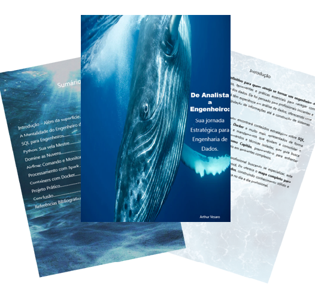

    

-------

# 📘 EBOOK: De Analista a Engenheiro de Dados

> ℹ️ **NOTE:** Este é o repositório do ebook estratégico para engenharia de dados, desenvolvido com auxílio de IA.

Projeto com o objetivo de criar um ebook completo sobre a jornada de transição da análise de dados para engenharia de dados, utilizando prompts de IA para desenvolvimento do conteúdo.

<a href="./output/Sua jornada Estratégica para Engenharia de Dados.pdf" title="View PDF now"> 📕 Clique aqui para ler o ebook</a>

## 💻 Tecnologias utilizadas no projeto

- [ChatGPT](https://chat.openai.com/)
- [PowerPoint](https://www.microsoft.com/en/microsoft-365/powerpoint)
- [Canva](https://www.canva.com/)

## 🧠 Prompts utilizados

**ChatGPT:**

| Ação | Prompt |
|------|--------|
| Estrutura do ebook | "Crie a estrutura completa de um ebook sobre a transição de analista para engenheiro de dados, incluindo mentalidade, ferramentas e projeto prático" |
| Conteúdo técnico | "Descreva os mandamentos do SQL para engenheiros de dados, focando em performance, integridade e escalabilidade" |
| Metáfora narrativa | "Desenvolva uma analogia entre engenheiro de dados e capitão de navio para explicar a mentalidade estratégica" |

## ✨ Features

- Conteúdo gerado e revisado via ChatGPT
- Estrutura pedagógica progressiva
- Projeto prático completo com dados de vendas
- Abordagem de mentalidade + ferramentas

## 📚 Estrutura do ebook

- Mentalidade do Engenheiro de Dados
- SQL para Engenheiros
- Python: Sua Vela Mestre
- Domine as Nuvens
- Airflow: Orchestration de Pipelines
- Processamento com Spark
- Containers com Docker
- Projeto Prático: Análise de Vendas

## 🛠️ Instruções de uso

Baixe o PDF na pasta `output/` e utilize como guia de estudos para ingressar na engenharia de dados.

---

⌨️ Desenvolvido com 💜 para a comunidade de dados
